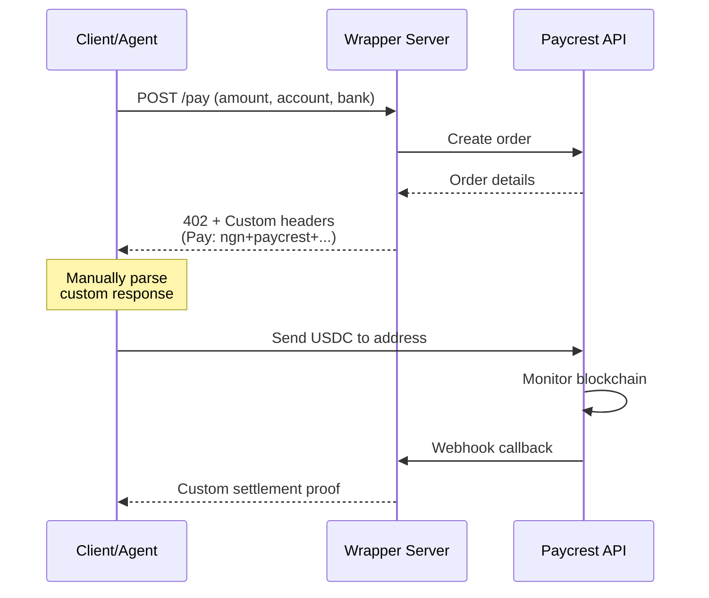
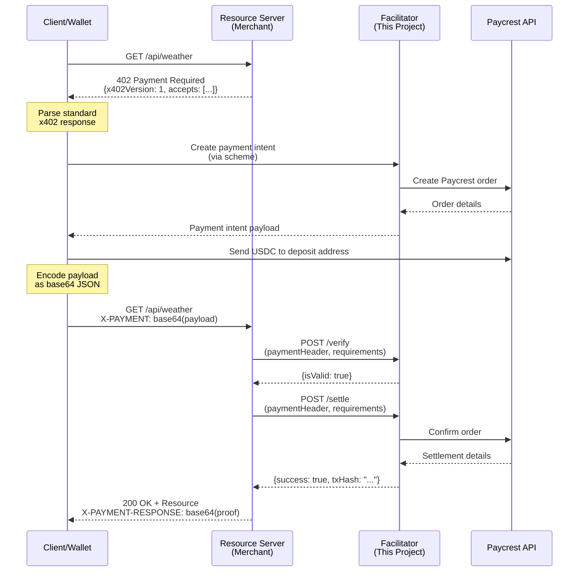

# x402 Protocol Compliance - Before & After

## Visual Comparison

### Before: Thin Wrapper (Non-Compliant)



**Issues:**
-  Custom headers (`Pay:` instead of `X-PAYMENT`)
-  Non-standard response schema
-  Mixed resource server + facilitator roles
-  Not reusable by other merchants
-  Incompatible with x402 wallets

---

### After: x402 V1 Facilitator (Compliant)



**Benefits:**
-  Standard `X-PAYMENT` header
-  x402 V1 compliant schemas
-  Separated concerns (merchant vs. facilitator)
-  Reusable by ANY merchant
-  Compatible with x402 wallets (Rabble, Grok, etc.)

---

## Architecture Comparison

### Before: Monolithic

```
┌─────────────────────────────────────┐
│     Wrapper Server (Port 3000)      │
│  ┌───────────────────────────────┐  │
│  │  Resource Server Logic        │  │
│  │  (Returns 402)                │  │
│  ├───────────────────────────────┤  │
│  │  Facilitator Logic            │  │
│  │  (Quotes, Creates Orders)     │  │
│  ├───────────────────────────────┤  │
│  │  Paycrest Integration         │  │
│  └───────────────────────────────┘  │
└─────────────────────────────────────┘
         ↓
    Paycrest API
```

**Problem:** Tightly coupled, not reusable.

---

### After: Modular (x402 Standard)

```
┌──────────────────────────┐     ┌──────────────────────────┐
│  Resource Server         │     │  Facilitator             │
│  (Merchant's API)        │────▶│  (This Project)          │
│  Port 4000               │     │  Port 3000               │
│                          │     │                          │
│  ┌────────────────────┐  │     │  ┌────────────────────┐  │
│  │ Business Logic     │  │     │  │ /supported         │  │
│  │ (Weather, Bills)   │  │     │  │ /verify            │  │
│  └────────────────────┘  │     │  │ /settle            │  │
│  ┌────────────────────┐  │     │  │ /webhook           │  │
│  │ x402 Integration   │  │     │  └────────────────────┘  │
│  │ (1 line of code!)  │  │     │  ┌────────────────────┐  │
│  └────────────────────┘  │     │  │ Scheme: ngn+paycrest│ │
└──────────────────────────┘     │  └────────────────────┘  │
                                 └──────────────────────────┘
                                          ↓
                                     Paycrest API
```

**Benefit:** Any merchant can use the facilitator. Separation of concerns.

---

## Code Comparison

### Merchant Integration

#### Before (Custom):
```typescript
// Merchant had to build custom integration
const response = await axios.post('http://wrapper/pay', {
  amount: 5000,
  account: '0123456789',
  bank: 'gtb'
});

// Parse custom response format
const { payAddress, exactUSDT } = response.data;
```

#### After (x402 Standard):
```typescript
// Merchant adds ONE endpoint
app.get('/api/weather', async (req, res) => {
  const payment = req.headers['x-payment'];
  
  if (!payment) {
    return res.status(402).json({
      x402Version: 1,
      accepts: [{ /* standard requirements */ }]
    });
  }
  
  // Delegate to facilitator
  const valid = await axios.post('http://facilitator/verify', {
    x402Version: 1,
    paymentHeader: payment,
    paymentRequirements: { /* ... */ }
  });
  
  if (valid.data.isValid) {
    await axios.post('http://facilitator/settle', { /* ... */ });
    return res.json({ /* deliver resource */ });
  }
});
```

**Benefit:** Merchant doesn't need to understand crypto, Paycrest, or blockchain.

---

## Endpoint Mapping

| Old Endpoint | New Endpoint | Purpose | Compliance |
|--------------|--------------|---------|------------|
| `ALL /pay` |  Removed | Custom payment handler | Non-standard |
| - | `GET /supported` ✨ | List supported schemes |  Required |
| - | `POST /verify` ✨ | Validate payment payloads |  Required |
| - | `POST /settle` ✨ | Execute settlements |  Required |
| `POST /webhook` | `POST /webhook` | Paycrest callbacks | ⚙️ Unchanged |
| `GET /` | `GET /` (enhanced) | Discovery + health |  Now compliant |

---

## Response Schema Evolution

### Old `/pay` Response (Non-Standard):
```json
{
  "scheme": "ngn+paycrest",
  "facilitator": "http://localhost:3000/pay",
  "orderId": "order-123",
  "payAddress": "0xABC...",
  "exactUSDT": "23.45",
  "expires": 1234567890
}
```

### New 402 Response (x402 Standard):
```json
{
  "x402Version": 1,
  "accepts": [
    {
      "scheme": "ngn+paycrest",
      "network": "base",
      "maxAmountRequired": "5000",
      "resource": "/api/weather",
      "description": "Weather data for Lagos",
      "mimeType": "application/json",
      "payTo": "0123456789",
      "maxTimeoutSeconds": 30,
      "asset": "USDC",
      "extra": {
        "bank": "gtb",
        "accountName": "Merchant Name"
      }
    }
  ],
  "error": null
}
```

**Key Differences:**
-  Includes `x402Version` for forward compatibility
-  `accepts` array allows multiple payment methods
-  Structured `PaymentRequirements` object
-  Standard field names (`maxAmountRequired` vs. `exactUSDT`)

---

## Client Flow Comparison

### Before (Custom):
```typescript
// 1. Call custom endpoint
const { data } = await axios.post('/pay', { amount, account, bank });

// 2. Parse custom response
const { payAddress, exactUSDT } = data;

// 3. Send crypto manually
await sendUSDC(payAddress, exactUSDT);

// 4. No standard proof mechanism
```

### After (x402 Standard):
```typescript
// 1. Request resource
try {
  await axios.get('/api/weather');
} catch (error) {
  if (error.response.status === 402) {
    // 2. Parse standard x402 response
    const requirements = error.response.data.accepts[0];
    
    // 3. Create payment intent
    const intent = await createPaymentIntent(...);
    
    // 4. Send crypto
    await sendUSDC(intent.depositAddress, intent.sendAmount);
    
    // 5. Encode payload
    const payload = {
      x402Version: 1,
      scheme: 'ngn+paycrest',
      network: 'base',
      payload: intent
    };
    
    // 6. Retry with proof
    const response = await axios.get('/api/weather', {
      headers: {
        'X-PAYMENT': Buffer.from(JSON.stringify(payload)).toString('base64')
      }
    });
    
    // 7. Get settlement proof
    const proof = response.headers['x-payment-response'];
  }
}
```

**Benefit:** Standard flow works with ANY x402 wallet.

---

## Ecosystem Impact

### Before:
```
Your App ──▶ Custom Wrapper ──▶ Paycrest
   ↑              ↑
   └──────────────┘
   Tight coupling
```

**Limitation:** Only YOUR apps can use it.

### After:
```
┌─────────────┐
│ Merchant A  │──┐
├─────────────┤  │
│ Merchant B  │──┤
├─────────────┤  │     ┌──────────────────┐
│ Merchant C  │──┼────▶│  Your Facilitator│──▶ Paycrest
├─────────────┤  │     └──────────────────┘
│ Merchant D  │──┤              ↑
├─────────────┤  │              │
│ Merchant E  │──┘         ┌────┴─────┐
└─────────────┘            │ x402     │
                           │ Wallets  │
                           └──────────┘
```

**Impact:** Ecosystem-wide adoption. Your facilitator becomes infrastructure.

---

## Testing Checklist

- [x] TypeScript compilation (`npm run build`)
- [x] Facilitator starts without errors
- [x] `/supported` returns correct schema
- [x] `/verify` validates payloads
- [x] `/settle` executes settlements
- [x] Resource server example works
- [x] Client example completes full flow
- [ ] Production deployment (TODO)
- [ ] Webhook signature verification (TODO)
- [ ] Database integration (TODO)

---

## Next Steps for Production

1. **Deploy Facilitator**
   - Railway/Fly.io/Vercel
   - Custom domain (e.g., `facilitator.ngn402.xyz`)
   - SSL certificate

2. **Register with x402 Ecosystem**
   - Submit to [x402.org](https://x402.org) directory
   - Add to Coinbase's facilitator list

3. **Onboard Merchants**
   - Create integration guides
   - Provide SDKs (Node.js, Python, Go)
   - Host demo merchants

4. **Monitor & Scale**
   - Set up logging (Datadog, Sentry)
   - Add rate limiting
   - Implement caching for rates

---

## Conclusion

The refactoring transforms this project from a **custom payment handler** to a **protocol-compliant facilitator** that can serve the entire x402 ecosystem.

**Key Achievement:** Any merchant can now accept Naira payments with 1 line of code, using YOUR facilitator as infrastructure.

 **Ready for production deployment and ecosystem adoption!**
